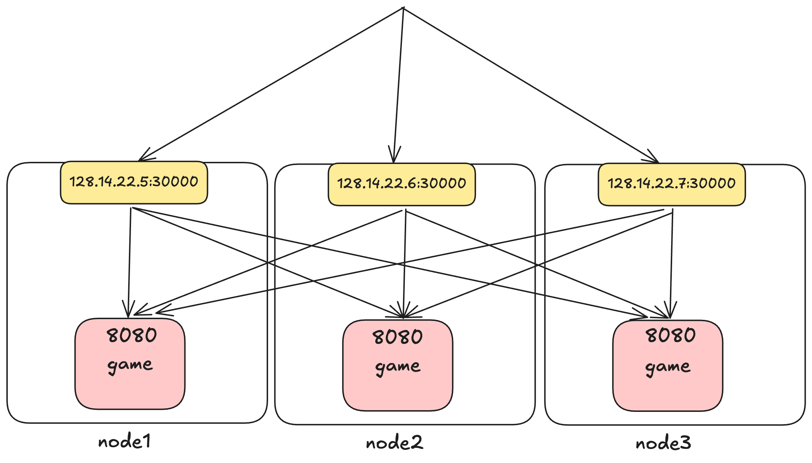

# Kubernetes Basics


### Making the game service accessible

Open the `game_service.yaml` file in the editor. 

Paste the following content in the file: 

```yaml
apiVersion: v1
kind: Service
metadata:
  name: game-server
  labels:
    app: game-server
spec:
  type: NodePort
  selector:
    app: game-server
  ports:
    - port: 8080         # Cluster-internal port
      targetPort: 8080   # Container port
      nodePort: 30080    # External port on each node
      protocol: TCP
      name: http
```

This defines a service that looks like this 


