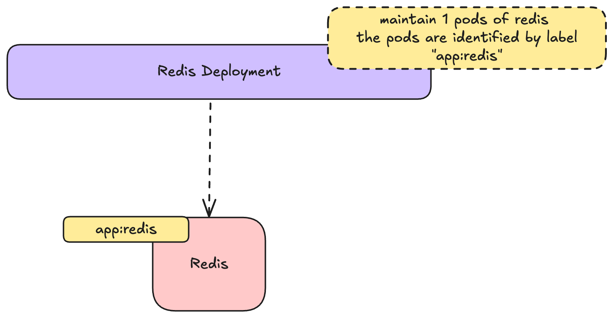

# Kubernetes Basics


### Creating the redis deployment

Open the `redis_deployment.yaml` file in the editor. 

Paste the following content in the file: 


```yaml
apiVersion: apps/v1
kind: Deployment
metadata:
  name: redis
spec:
  replicas: 1
  selector:
    matchLabels:
      app: redis
  template:
    metadata:
      labels:
        app: redis
    spec:
      containers:
        - name: redis
          image: redis:7
          command:
          - redis-server
          resources:
            requests:
              cpu: "125m"
              memory: 100Mi
            limits:
              cpu: "125m"
              memory: 100Mi
          ports:
            - containerPort: 6379
```

This defines a deployment that looks like this



