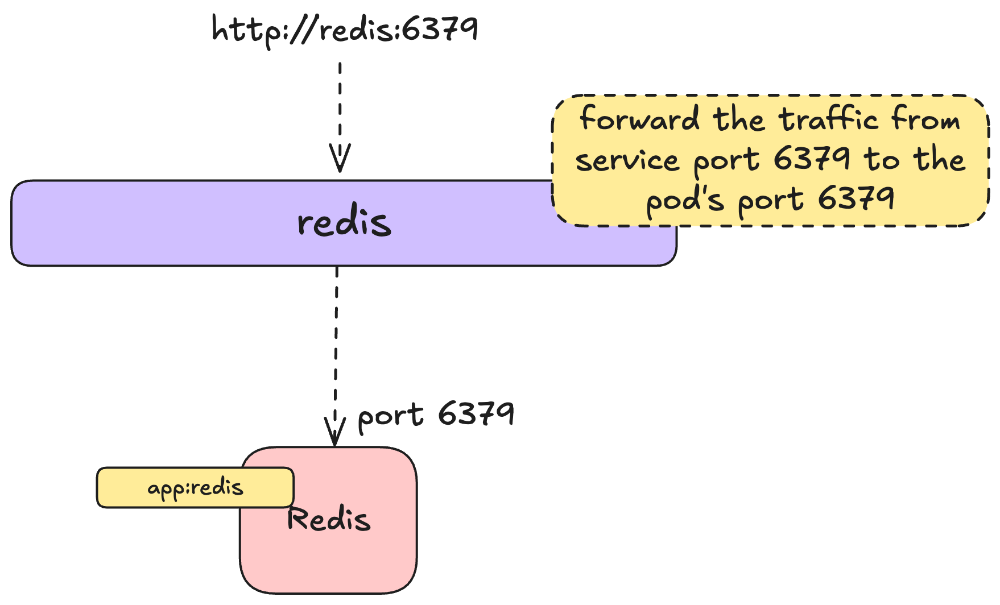

# Kubernetes Basics


### Making redis accessible within the cluster

Open the `redis_service.yaml` file in the editor. 

Paste the following content in the file: 

```yaml
apiVersion: v1
kind: Service
metadata:
  name: redis
  labels:
    app: redis
spec:
  type: ClusterIP
  selector:
    app: redis
  ports:
    - name: redis
      port: 6379        # port inside the cluster
      targetPort: 6379  # port on the redis pod/container
```

This defines a service that looks like this 



